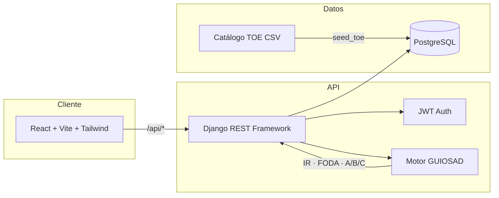
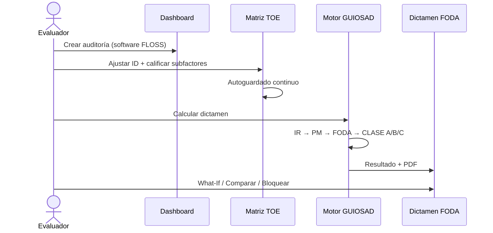

<div align="center">

# TechCheck Pro

### Plataforma web para evaluar la adopción de software FLOSS con el método GUIOS

[](https://techcheck-pro.vercel.app)
[](https://react.dev)
[](https://www.djangoproject.com)
[](https://www.postgresql.org)
[](https://tailwindcss.com)

**GUIOS** · **TOE** · **FODA** · **Dictamen A/B/C** · **What-If** · **Multi-usuario**

[Demo en vivo](https://techcheck-pro.vercel.app) · [Guía de exposición](./GUIA_EXPOSICION.md) · [Documentación](./DOCUMENTACION_PROYECTO.pdf)

</div>

---

## ¿Qué es TechCheck Pro?

**TechCheck Pro** (*GUIOSPRO_FLOSS*) es la implementación web del método **GUIOS** — *Guía para la Evaluación de la Adopción de Software FLOSS* — basado en el marco **TOE** (*Technology–Organization–Environment*).

La aplicación guía a evaluadores y decisores a través de un proceso estructurado para responder una pregunta clave:

> **¿Debe nuestra organización adoptar este software FLOSS?**

El motor **GUIOSAD** calcula automáticamente importancia relativa, matriz FODA y un dictamen final (**CLASE A**, **B** o **C**), fiel al algoritmo original de la investigación.

---

## Capturas

| Panel de control | Matriz TOE | Dictamen FODA |
|:----------------:|:----------:|:-------------:|
| Gestión de auditorías, filtros y alertas | Calificación Likert + importancia del decisor | Radar TOE, FODA y export PDF |

> Sustituye estas celdas con capturas reales cuando las subas al repo (`docs/screenshots/`).

---

## Características principales

| Módulo | Descripción |
|--------|-------------|
| **Panel de control** | Crear, filtrar y retomar auditorías FLOSS |
| **Matriz TOE** | 61 subfactores en 18 factores · escala Likert 1–4 · autoguardado |
| **Dictamen FODA** | Cálculo oficial · radar por dimensión · tabla FODA · PDF |
| **What-If** | Simula escenarios sin modificar la evaluación real |
| **Comparar** | Confronta dos auditorías software A vs B |
| **Dashboard gerencial** | Métricas agregadas para administradores |
| **Catálogo TOE** | CRUD del modelo metodológico (admin) |
| **Usuarios y roles** | Evaluador / Administrador con JWT |

### Metodología implementada

```
IE + IL  →  IS (Importancia Sugerida, catálogo tesis)
IS + ID  →  IR (Importancia Relativa, por evaluación)
Likert   →  PM (Ponderación media por factor)
PM + Alcance  →  FODA (Fortaleza / Oportunidad / Debilidad / Amenaza)
FODA × IR  →  Dictamen CLASE A · B · C
```

| Clase | Significado |
|:-----:|-------------|
| **A** | Adoptar — solo fortalezas y oportunidades en factores relevantes |
| **B** | Condicionado — debilidades en factores opcionales |
| **C** | Rechazar / posponer — debilidades en factores importantes o fundamentales |

Detalle completo de fórmulas y origen de datos → [`GUIA_EXPOSICION.md`](./GUIA_EXPOSICION.md)

---

## Arquitectura



### Stack tecnológico

| Capa | Tecnologías |
|------|-------------|
| **Frontend** | React 19 · Vite 8 · Tailwind CSS 4 · Axios · Recharts · React Router 7 |
| **Backend** | Django 4.2 · Django REST Framework · SimpleJWT · xhtml2pdf |
| **Base de datos** | PostgreSQL 15 |
| **Infraestructura** | Docker Compose · Vercel (frontend + backend serverless) · Neon Postgres |

---

## Modelo TOE (catálogo oficial)

| Elemento | Cantidad | Fuente |
|----------|:--------:|--------|
| Dimensiones | 3 | Tecnológica · Organizacional · Económica |
| Factores | 18 | `backend/core/data/factors.csv` |
| Subfactores | 61 | `backend/core/data/guiosad_data.csv` |
| IS predefinida | 9× Importante · 9× Opcional | Investigación Cap. V |

---

## Inicio rápido

### Requisitos

- Docker y Docker Compose **o**
- Node.js 20+ · Python 3.12+ · PostgreSQL 15

### Opción 1 — Docker (recomendado)

```bash
git clone https://github.com/SnayderC/TechCheckPro.git
cd TechCheckPro

docker compose up --build
```

| Servicio | URL |
|----------|-----|
| Frontend | http://localhost:3000 |
| Backend API | http://localhost:8000/api |
| PostgreSQL | localhost:5432 |

Cargar catálogo TOE y crear admin (primera vez):

```bash
docker compose exec backend python manage.py seed_toe
docker compose exec backend python manage.py create_admin --username admin --password TU_PASSWORD
docker compose exec backend python manage.py create_evaluador --username evaluador --password TU_PASSWORD
```

### Opción 2 — Desarrollo local

**Backend**

```bash
cd backend
python -m venv .venv && source .venv/bin/activate
pip install -r requirements.txt

# Crea backend/.env con las variables de la tabla inferior
python manage.py migrate
python manage.py seed_toe
python manage.py runserver
```

**Frontend**

```bash
cd frontend
npm install
echo "VITE_API_URL=http://localhost:8000/api" > .env
npm run dev
```

---

## Variables de entorno

### Backend (`backend/.env`)

| Variable | Descripción |
|----------|-------------|
| `SECRET_KEY` | Clave secreta Django |
| `DEBUG` | `True` en local · `False` en producción |
| `DATABASE_URL` | Connection string PostgreSQL |
| `ALLOWED_HOSTS` | Hosts permitidos (incluir `.vercel.app`) |
| `ADMIN_USERNAME` / `ADMIN_PASSWORD` | Admin inicial (build Vercel) |

### Frontend (`frontend/.env`)

| Variable | Descripción |
|----------|-------------|
| `VITE_API_URL` | Base URL de la API (`/api` en Vercel · `http://localhost:8000/api` en local) |

---

## Despliegue en Vercel

El proyecto usa **Vercel** con dos servicios definidos en `vercel.json`:

- **frontend** — build Vite → SPA con rewrite a `index.html`
- **backend** — Django WSGI con rewrite `/api/*`

En cada deploy, `backend/build.py` ejecuta:

1. `migrate`
2. `seed_toe` (sincroniza catálogo TOE)
3. `create_admin` (si existen `ADMIN_USERNAME` y `ADMIN_PASSWORD`)

```bash
npx vercel --prod
```

**Producción:** https://techcheck-pro.vercel.app

---

## API REST (resumen)

Base: `/api/`

| Método | Endpoint | Descripción |
|--------|----------|-------------|
| `POST` | `/token/` | Login JWT |
| `GET` | `/catalogo/` | Catálogo TOE completo |
| `POST` | `/evaluaciones/iniciar/` | Nueva auditoría |
| `GET` | `/evaluaciones/<id>/` | Detalle + puntajes |
| `POST` | `/evaluaciones/autosave/` | Autoguardado progreso |
| `POST` | `/evaluaciones/calcular/` | Calcular dictamen FODA |
| `POST` | `/evaluaciones/simular/` | What-If (sin persistir) |
| `POST` | `/evaluaciones/comparar/` | Comparar dos evaluaciones |
| `GET` | `/evaluaciones/<id>/pdf/` | Exportar PDF |
| `GET` | `/dashboard/ejecutivo/` | Dashboard admin |

Autenticación: `Authorization: Bearer <access_token>`

---

## Estructura del repositorio

```
GUIOSPRO_FLOSS/
├── backend/
│   ├── core/
│   │   ├── data/              # factors.csv · guiosad_data.csv
│   │   ├── utils/
│   │   │   ├── guiosad_calculos.py   # IR, FODA, A/B/C
│   │   │   └── guiosad_engine.py     # Motor de procesamiento
│   │   ├── views.py           # API evaluaciones
│   │   └── tests.py           # Tests de fidelidad metodológica
│   ├── build.py               # Build hook Vercel
│   └── techcheck/             # Settings Django
├── frontend/
│   └── src/
│       ├── pages/             # Dashboard · Evaluation · Report · WhatIf…
│       └── utils/             # guiosadCalculos.js (paridad con backend)
├── docker-compose.yml
├── vercel.json
├── GUIA_EXPOSICION.md         # Guía metodológica para exposición
└── DOCUMENTACION_PROYECTO.pdf
```

---

## Tests

```bash
# Con Docker
docker compose exec backend python manage.py test core.tests

# Local
cd backend && python manage.py test core.tests
```

Los tests validan que las fórmulas de **IR**, **FODA** y **dictamen A/B/C** son idénticas al prototipo original `guiosad.html`.

---

## Flujo de uso



---

## Documentación adicional

| Recurso | Contenido |
|---------|-----------|
| [`GUIA_EXPOSICION.md`](./GUIA_EXPOSICION.md) | Origen de IE/IL/IS/ID/IR, fórmulas, guion de exposición |
| [`DOCUMENTACION_PROYECTO.pdf`](./DOCUMENTACION_PROYECTO.pdf) | Documentación técnica completa del proyecto |
| [`capituloV.md`](./capituloV.md) | Resumen Capítulo V de la tesis (catálogo TOE) |

---

## Contribuir

1. Fork del repositorio
2. Crea una rama: `git checkout -b feature/mi-mejora`
3. Commit: `git commit -m "feat: descripción clara"`
4. Push y abre un Pull Request

---

## Créditos

Proyecto académico basado en la metodología **GUIOS** para la evaluación de adopción de software libre (**FLOSS**), implementada como plataforma web moderna con motor algorítmico **GUIOSAD**.

---

<div align="center">

**TechCheck Pro** — Decisiones informadas sobre adopción FLOSS

[Demo](https://techcheck-pro.vercel.app) · [Issues](https://github.com/SnayderC/TechCheckPro/issues) · [Guía metodológica](./GUIA_EXPOSICION.md)

</div>
